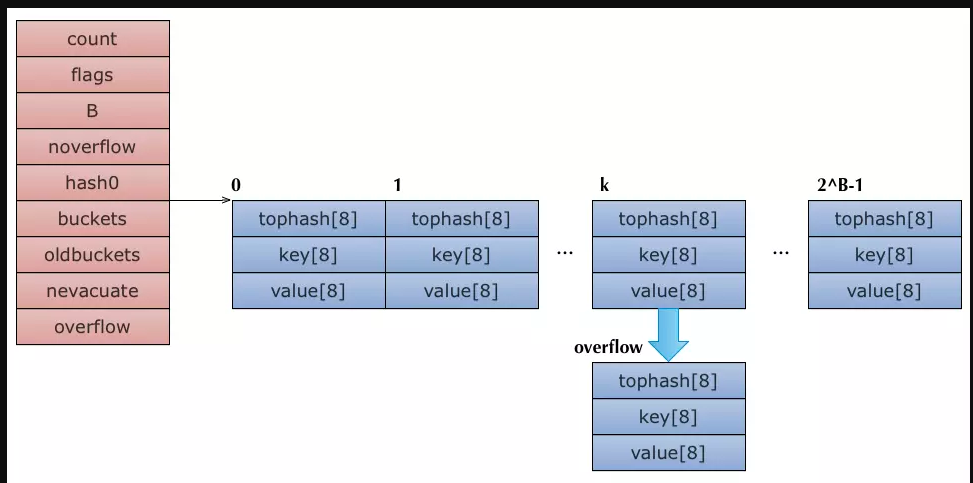

##### Golang Map


`GoLang map`的内部实现是`HashMap  (hmap)`,核心元素是若干个桶`Bucket`组成的数组,每个`bucket (bmap)`可以存放若干个元素,key通过hash算法被归入不同的
`bucket`中,当超过8个元素需要存入某个`bucket`,`hmap`会使用`extra`中的`overflow`来扩展`bucket`


```go
// A header for a Go map.
type hmap struct {
	// Note: the format of the Hmap is encoded in ../../cmd/internal/gc/reflect.go and
	// ../reflect/type.go. Don't change this structure without also changing that code!
	count     int  //len()返回map的size,既有多少kv对
	flags     uint8
	B         uint8  // 表示hashtable共有2^B个Buckets
	noverflow uint16 // approximate number of overflow buckets; see incrnoverflow for details
	hash0     uint32 // hash seed

	buckets    unsafe.Pointer // array of 2^B Buckets. may be nil if count==0.
	oldbuckets unsafe.Pointer // previous bucket array of half the size, non-nil only when growing
	nevacuate  uintptr        // progress counter for evacuation (buckets less than this have been evacuated)

	extra *mapextra // optional fields
}
```

```go
// mapextra holds fields that are not present on all maps.
type mapextra struct {
	// If both key and value do not contain pointers and are inline, then we mark bucket
	// type as containing no pointers. This avoids scanning such maps.
	// However, bmap.overflow is a pointer. In order to keep overflow buckets
	// alive, we store pointers to all overflow buckets in hmap.overflow and h.map.oldoverflow.
	// overflow and oldoverflow are only used if key and value do not contain pointers.
	// overflow contains overflow buckets for hmap.buckets.
	// oldoverflow contains overflow buckets for hmap.oldbuckets.
	// The indirection allows to store a pointer to the slice in hiter.
	overflow    *[]*bmap
	oldoverflow *[]*bmap

	// nextOverflow holds a pointer to a free overflow bucket.
	nextOverflow *bmap
}
```

```go
// A bucket for a Go map.
type bmap struct {
	// tophash generally contains the top byte of the hash value
	// for each key in this bucket. If tophash[0] < minTopHash,
	// tophash[0] is a bucket evacuation state instead.
	tophash [bucketCnt]uint8
	// Followed by bucketCnt keys and then bucketCnt values.
	// NOTE: packing all the keys together and then all the values together makes the
	// code a bit more complicated than alternating key/value/key/value/... but it allows
	// us to eliminate padding which would be needed for, e.g., map[int64]int8.
	// Followed by an overflow pointer.
}
```





##### 查找过程

- 根据key计算hash值
- 如果存在`oldtable`,首先在`oldtable`里面查找,如果找到的`bucket`已经`evacuated`(疏散)
- 在`newtable`中查找到对应的`value`


##### 插入过程分析

- 根据key计算出hash值,从而得出对应的bucket
- 


> 如何并发使用map

map不是goroutine安全的,所以有多个goroutine对map进行写操作是会panic,多个goroutine读写map应加锁(RWMutex)


```go
package  main
func main() {

	m := make(map[int]int)
	go func() {
		for {
			_ = m[1]
		}
	}()

	go func() {
		for {
			m[2] = 2
		}
	}()

	select {}
}

```

执行该程序会得出`error :map不能并发读写`


##### `golang`对于并发map的解决方案

```go
package main
var counter = struct{
	    sync.RWMutex
	    m map[string]int
}{m:make(map[string]int)}

```


读数据:
```go
counter.RLock()
n:=counter.m["test"]
counter.RUnlock()
```

写数据:
```go
counter.Lock()
counter.m["test"] = 2
counter.Unlock()
```


`sync.map`

- 空间换时间,通过冗余的两个数据结构(`read,dirty`)实现加锁对性能的影响
- 使用只读数据(read),避免读写冲突
- 动态调整,miss次数多了会将ditry提升为read
- double-checking
- 优先从read结构读取数据
- 延迟删除


```go
type Map struct{
	
	mu Mutex   //当涉及到dirty数据操作的时候,需要使用这个锁
	
	
	
	// 一个只读的数据结构,因为只读,所以不会有读写冲突
	// 所以这个数据中读取总是安全的
	// 
	read atomic.Value 
	
	//
	dirty map[interface{}] * entry
	
	// 当从map中读取到entry的时候,如果read不包含这个entry,会尝试从dirty中读取,并且将misses的值加一
	// 当Misses累积到dirty的长度的时候,就会将dirty提升为read,避免dirty中Misses太多次
	misses int
}
```

```go
type readOnly struct {
	m       map[interface{}]*entry
	amended bool // true if the dirty map contains some key not in m.(如果这个值是true的话,代表某些值在dirty map但是没在这里)
}
```

`amended`指明了,`map.dirty`中有`readOnly.m`未包含的数据,所以如果从`map.read`找不到数据还要进一步去map.dirty里面找


`readOnly.m`和`map.dirty`的存储类型是一个`*entry`,它包含一个指针`p`,指向用户的`value`值


##### `load`操作


```go

func (m *Map) Load(key interface{}) (value interface{}, ok bool) {
	// 从m.read得到只读readOnly,从他的map查,不需要加锁
	read, _ := m.read.Load().(readOnly)
	e, ok := read.m[key]
	// 如果没找到,但是m.dirty里面有数据,需要从m.dirty里面去找
	if !ok && read.amended {
		m.mu.Lock()
		// Avoid reporting a spurious miss if m.dirty got promoted while we were
		// blocked on m.mu. (If further loads of the same key will not miss, it's
		// not worth copying the dirty map for this key.)
		// 双检查,避免m.dirty被m.read替换
		read, _ = m.read.Load().(readOnly)
		e, ok = read.m[key]
		// 如果m.read还是不存在,需要从m.dirty里面去找
		if !ok && read.amended {
			e, ok = m.dirty[key]
			// Regardless of whether the entry was present, record a miss: this key
			// will take the slow path until the dirty map is promoted to the read
			// map.
			
			// 不管找没找到,都会提升Miss计数,如果miss数量大于dirty则转换
			m.missLocked()
		}
		m.mu.Unlock()
	}
	if !ok {
		return nil, false
	}
	return e.load()
}
```
 
 
 
##### `map`的`store`操作

```go
// Store sets the value for a key.
func (m *Map) Store(key, value interface{}) {
	// 检查read是否有这个key
	read, _ := m.read.Load().(readOnly)
	// 如果存在这个key的话,尝试存储这个值
	if e, ok := read.m[key]; ok && e.tryStore(&value) {
		return
	}
	
	// 如果m.read 不存在或者已经被删除
	m.mu.Lock()
	read, _ = m.read.Load().(readOnly)
	if e, ok := read.m[key]; ok {
		// 如果标记成未被删除,把这个值存入m.dirty
		if e.unexpungeLocked() {
			// The entry was previously expunged, which implies that there is a
			// non-nil dirty map and this entry is not in it.
			m.dirty[key] = e
		}
		e.storeLocked(&value)  //更新
	} else if e, ok := m.dirty[key]; ok { //如果有这个值,直接进行更新
		e.storeLocked(&value)
	} else {
		// 如果是新的键值
		if !read.amended {  //m.dirty中没有新数据,往m.dirty新增一个新键
			// We're adding the first new key to the dirty map.
			// Make sure it is allocated and mark the read-only map as incomplete.
			m.dirtyLocked()
			m.read.Store(readOnly{m: read.m, amended: true})
		}
		m.dirty[key] = newEntry(value) // 将这个entry放入m.dirty中
	}
	m.mu.Unlock()
}
```


```go
func (m *Map) Delete(key interface{}) {
	read, _ := m.read.Load().(readOnly)
	e, ok := read.m[key]
	// 如果不存在则去dirty里面找
	if !ok && read.amended {
		m.mu.Lock()
		read, _ = m.read.Load().(readOnly)
		e, ok = read.m[key]
		if !ok && read.amended {
			// 删除
			delete(m.dirty, key)
		}
		m.mu.Unlock()
	}
	if ok {
		e.delete()
	}
}
```


##### `Range`


```go
func (m *Map) Range(f func(key, value interface{}) bool) {
	// We need to be able to iterate over all of the keys that were already
	// present at the start of the call to Range.
	// If read.amended is false, then read.m satisfies that property without
	// requiring us to hold m.mu for a long time.
	// 如果m.dirty里面有新数据,则提升m.dirty,然后再遍历
	read, _ := m.read.Load().(readOnly)
	if read.amended {
		// m.dirty contains keys not in read.m. Fortunately, Range is already O(N)
		// (assuming the caller does not break out early), so a call to Range
		// amortizes an entire copy of the map: we can promote the dirty copy
		// immediately!
		m.mu.Lock()
		// 双重检查
		read, _ = m.read.Load().(readOnly)
		if read.amended {
			read = readOnly{m: m.dirty}
			m.read.Store(read)
			m.dirty = nil
			m.misses = 0
		}
		m.mu.Unlock()
	}

	for k, e := range read.m {
		v, ok := e.load()
		if !ok {
			continue
		}
		if !f(k, v) {
			break
		}
	}
}
```


[map](https://zhuanlan.zhihu.com/p/44585993)

[map原理](https://www.jianshu.com/p/aa0d4808cbb8)

// must be read
[golang map](https://studygolang.com/articles/13226)

