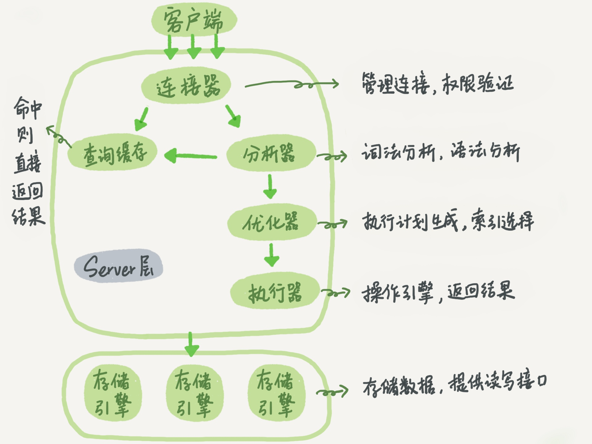
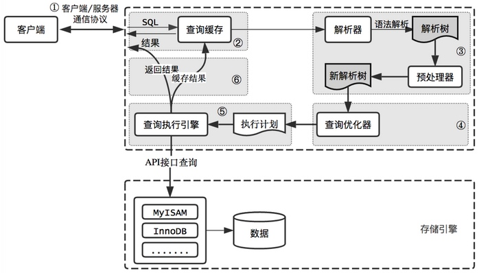

#### mysql







##### 连接器

连接器的主要功能是负责跟客户端建立连接,获取权限,维持和管理连接

##### 查询缓存


执行语句的时候,mysql首先去查询缓存,并且将结果以k-v的形式存储起来.如果存在缓存,直接返回结果


**如果这个表修改了,那么这个表中的缓存都不再生效,查询缓存会被清空**


##### 分析器
当查询缓存失效或者无缓存的时候,mysql的server就会利用分析器来分析语句,分析器也叫解析器

mysql分析器分为两个部分
 - 第一部分是用来词法分析扫描字符流,根据构词规则识别单个单词
 - 第二部分是语法分析的基础上将单词序列组成语法短语,最后生成语法树
 
 
 
 
##### 优化器
优化器的任务是发现执行sql查询的最佳方案(减少开销,提高执行效率)


##### 执行器

执行器会根据表定义的引擎,去使用该引擎的接口

- 连接器负责和客户端进行通信
- 查询缓存:查询是否存在Key-value缓存
- 解析器:负责解析和转发sql
- 预处理器:对解析后的sql进行验证
- 优化器:得到一个执行计划
- 查询执行引擎:执行器执行语句得到数据结果集
- 将数据放回给调用端


##### 聚集索引和非聚集索引

正文内容按照一个特定维度排序存储,这个特定的维度就是聚集索引

聚集索引一般是表中的主键索引,如果表中没有显示指定主键,则会选择表中第一个不允许为Null的唯一索引,如果还没有的话,就采用Innodb存储引擎
为每行数据内置的6字节ROWID作为聚集索引


非聚集索引:该索引中的索引的逻辑顺序与磁盘上行的物理存储顺序不同,一个表中可以拥有多个非聚集索引

非聚集索引分成:普通索引,唯一索引,全文索引


##### Mysql Explain 


```
select_type: --SIMPLE() 查询类型(简单查询,联合查询,子查询)


type:range -- 区间索引

```


#### B-Tree

结构:`B-Tree`的每一个节点都是一个二元数组:[key,value],所有节点都可以存储数据,key为索引Key,data为key之外的数据


检索原理:

首先从根节点进行二分查找,如果找到则返回对应的节点data,否则对相应区间的指针指向的节点进行递归查找,直到找到节点或未找到节点返回Null指针


#### B+ Tree

* 与B-Tree相比,B+Tree有以下不同点:非叶子节点不存储data,只存储索引Key,只有叶子节点才存储data
* 在经典的b+Tree基础上进行了优化,增加了顺序访问指针,在B+Tree的每个叶子节点增加一个指向相邻叶子节点增加一个指向相邻叶子节点的指针
就形成了带有顺序访问指针的B+Tree,这样提高了区间访问性能   (无需返回上层父节点重复遍历查找,能够减少I/O操作)
* 叶子节点存储实际记录的行,记录行相对比较紧密的存储,适合大数据量磁盘存储,非叶子节点存储记录的pk,用于加速查询,适合内存存储


##### Mysql 主从同步原理

主库将变更写入`binlog`日志,然后从库链接主库后,从库有一个`I/O`线程,将主库的`binlog`保存到本地,写入一个`relay`中继日志中,接着从库会有一个
sql线程会从中继日志读取`binlog`,然后执行`binlog`的内容


##### Mysql事务处理
事务日志实际上有两种:
- 回滚日志(`undo log`)
- 重做日志(`redo log`)


##### 为什么是最左匹配原则


>  数据库为什么要建立索引

用于提升数据库的查找速度

> 哈希比树更快,索引为什么不设计成树型

哈希:插入/修改/删除 时间复杂度都是O(1)

树: 例如平衡二叉树, 查询/修改/删除时间复杂度是O(logn)

不管是读写请求,哈希类型的索引都比树要快一些


但是对于排序和比较,时间复杂度会退化到O(n)

**Innodb不支持哈希索引**


> 局部性原理逻辑

* 内存读写快,磁盘读写慢,而且慢很多
* 磁盘预读:磁盘读写并不是按需读取,而是按页读取,一次会读取一页的数据,每次加载更多的数据,如果未来读取的数据要在这一页中,可以避免未来io提升效率(通常:1页是4k)
* 局部性原理:软件设计要尽量遵循"数据读取集中",使用一个数据,大概率会使用其附近的数据,这样的操作能够充分提升磁盘io


> 为什么要用索引

一般系统应用中,读写比例在10:1左右,因为数据量较大,数据库是不可能将所有数据都读入内存的,那么就会有磁盘的寻址操作,

如何查找一个数据,因为B+tree是一颗多叉树,首先会将根节点从文件加载到内存,然后通过二分搜索查找到该值对应的下一个节点,依次类推,最后找到该数据


> b+树性质

通过学习,我们知道B+树的`i/o`次数取决于树的高度h,磁盘块的大小是一个数据页的大小,是固定的,如果数据项占用的空间越小,数据项数量越多,树的高度就越低


[mysql 文章](http://www.cnblogs.com/annsshadow/p/5037667.html)


[Mysql 索引](http://blog.codinglabs.org/articles/theory-of-mysql-index.html)

[MYSQL 美团](https://tech.meituan.com/mysql_index.html)


[MYSQL ](https://www.jianshu.com/p/486a514b0ded)

